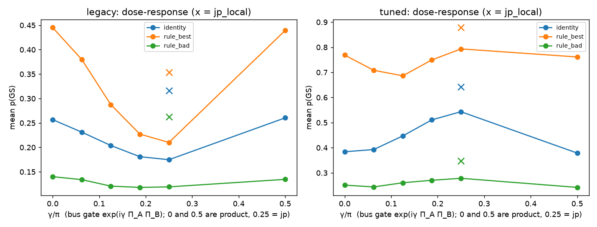
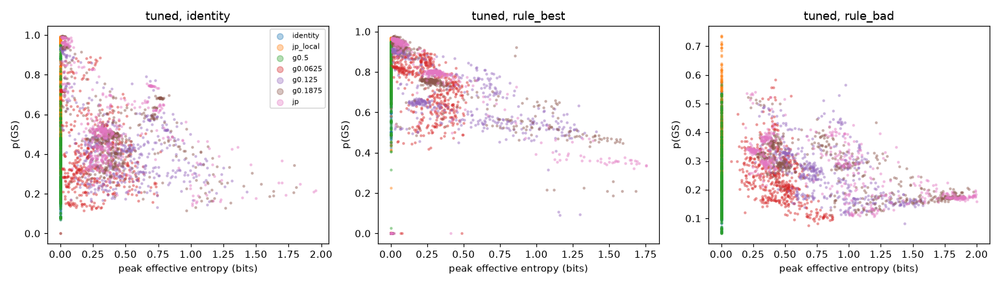

# Does entanglement help? Controlled bus-gate comparison (n=8) — DRAFT, 2026-10-09 00:30 CST

**Status: DRAFT.** The two main fleets (legacy and tuned, 7 arms × 3 layouts × 20 H × 25 trials = 10,500 trials each)
are complete. The 2×2 factorial / dose follow-up (`ent_tuned_fu`, `ent_legacy_fu`) is pending; see
[Pending](#pending-runs). Code: `noiseless/run_entanglement_control.py`. Analysis:
`noiseless/analyze_entanglement_control.py` → `entanglement_control_analysis_summary.json` and
`ent_control_figs/`. Per-trial dumps stay on the box (`noiseless/results/ent_control_runs/`, gitignored).

## Setup
- **Problem.** The 20 `four_sat` instances in full form, H = Σ_C Π_{i∈C⁺}(I+Z_i)/2 · Π_{j∈C⁻}(I−Z_j)/2 (counts
  unsatisfied 4-literal clauses; unique GS, E_GS = 0). No reduction.
- **Circuit.** Per layer: R_d(θ_d,φ_d), R_e(θ_e,φ_e), ECD_dA(β_d), ECD_eB(β_e), then the fixed bus gate U on A⊗B.
  ECD(β) = σ⁻⊗D(β/2) + σ⁺⊗D(−β/2), Fock cutoff 8. Π = (−1)^n̂.
- **Arms.** They differ only in U. All are diagonal in the Fock basis.

| arm | U on A⊗B | entangling? |
|---|---|---|
| identity | I | no |
| jp_local | L⊗L, L = diag((−i)^{n mod 2}) = e^{−iπ/4}·exp(iπ/4·Π) | no (product, non-Gaussian local parity phase) |
| g0.5 | exp(iπ/2·Π_AΠ_B) = i·Π_A⊗Π_B | no (product; Π is gauge-absorbable, since Π·ECD(β)·Π = ECD(−β)) |
| g0.0625, g0.125, g0.1875 | exp(iγΠ_AΠ_B), γ/π = 1/16, 1/8, 3/16 | yes, increasing |
| jp | diag((−i)^{(n+m) mod 2}) = e^{−iπ/4}·exp(iπ/4·Π_AΠ_B) | yes (maximal in this family) |

- **Protocols.**
  - legacy: fixed L=4, plain SPSA, 200 steps, random init, 401 evals.
  - tuned: growth L=1→4 (warm start, kick σ=0.05), SPSA-Adam with lr 0.5/0.2/0.05/0.02 at 200 steps/stage, 1604 evals.
  - Both use the Gibbs cost with adaptive η.
- **Layouts.**
  - identity (legacy class 0).
  - rule_best: tier rule on the **true** GS, permutation-only, binary code, both cavities' GS codewords 000 or 111.
  - rule_bad: true GS at Fock levels 2–5 on both cavities, preferring 3 and 4.
- **Pairing.** The seed is seed0 + 1e6·H + 1e3·L + trial. It is the same for every arm, layout and protocol, so x0 and the SPSA
  perturbation stream are identical across arms.
- **Entropy.** Von Neumann entropy (bits) across the (d,A)|(e,B) cut. The **effective peak** is the maximum over every state that can
  still affect the output. It excludes the final bus gate, which is diagonal in the measured basis and so can't change p(x).
  Local gates don't change the cut entropy, so the entropy just before the final U equals the entropy after layer L−1.

## Per arm × layout × protocol (success / mean p(GS); effective peak entropy in bits)

**legacy (401 evals)**

| arm | identity layout | rule_best | rule_bad | peak S (id/best/bad) |
|---|---|---|---|---|
| identity | 0.878 / 0.257 | 0.974 / **0.445** | 0.922 / 0.140 | 0/0/0 |
| jp_local | **0.948 / 0.316** | 0.954 / 0.354 | **0.976 / 0.263** | 0/0/0 |
| g0.5 | 0.880 / 0.260 | 0.966 / 0.439 | 0.930 / 0.135 | 0/0/0 |
| g0.0625 | 0.892 / 0.231 | 0.936 / 0.380 | 0.964 / 0.134 | 0.48/0.48/0.51 |
| g0.125 | 0.910 / 0.204 | 0.926 / 0.288 | 0.972 / 0.121 | 1.09/1.10/1.20 |
| g0.1875 | 0.910 / 0.181 | 0.928 / 0.227 | 0.946 / 0.118 | 1.48/1.50/1.60 |
| jp | 0.902 / 0.175 | 0.948 / 0.210 | 0.942 / 0.119 | 1.59/1.61/1.70 |

**tuned (1604 evals)**

| arm | identity layout | rule_best | rule_bad | peak S (id/best/bad) |
|---|---|---|---|---|
| identity | 0.692 / 0.384 | 0.974 / 0.769 | 0.952 / 0.251 | 0/0/0 |
| jp_local | **0.998 / 0.642** | 0.970 / **0.878** | **1.000 / 0.348** | 0/0/0 |
| g0.5 | 0.700 / 0.379 | 0.972 / 0.761 | 0.944 / 0.242 | 0/0/0 |
| g0.0625 | 0.796 / 0.393 | 0.966 / 0.708 | 0.988 / 0.244 | 0.25/0.24/0.44 |
| g0.125 | 0.948 / 0.447 | 0.964 / 0.686 | 0.998 / 0.261 | 0.46/0.40/0.82 |
| g0.1875 | 0.968 / 0.511 | 0.956 / 0.750 | 0.986 / 0.271 | 0.45/0.35/0.91 |
| jp | 0.990 / 0.543 | 0.970 / 0.793 | 0.982 / 0.278 | 0.40/0.30/0.89 |



## Paired deltas: entangling arm − product control
Values are mean Δp(GS) over 500 pairs. Each p-value is a Wilcoxon signed-rank p, Holm-corrected within each
(protocol, layout) family of 12 tests. The last column counts Hamiltonians, out of 20, where the per-H mean Δ vs identity
is > 0 (a conservative cluster-level view). Raw sign-test and McNemar p-values are in the JSON.

| protocol | layout | arm | vs identity | vs jp_local | vs g0.5 | H wins vs identity |
|---|---|---|---|---|---|---|
| legacy | identity | g0.0625 | −0.026 (8e−08) | −0.085 (1e−26) | −0.029 (4e−06) | 4/20 |
| legacy | identity | g0.125 | −0.053 (2e−19) | −0.112 (1e−46) | −0.057 (4e−19) | 2/20 |
| legacy | identity | g0.1875 | −0.076 (8e−35) | −0.135 (1e−59) | −0.080 (5e−31) | 1/20 |
| legacy | identity | jp | −0.082 (2e−35) | −0.141 (1e−63) | −0.086 (5e−36) | 1/20 |
| legacy | rule_best | g0.0625 | −0.065 (1e−23) | +0.026 (4e−04) | −0.059 (8e−13) | 0/20 |
| legacy | rule_best | g0.125 | −0.158 (2e−60) | −0.066 (8e−13) | −0.152 (1e−52) | 0/20 |
| legacy | rule_best | g0.1875 | −0.218 (2e−73) | −0.127 (3e−43) | −0.212 (2e−68) | 0/20 |
| legacy | rule_best | jp | −0.235 (1e−74) | −0.144 (3e−53) | −0.229 (7e−73) | 0/20 |
| legacy | rule_bad | g0.0625 | −0.006 (0.096) | −0.129 (3e−65) | −0.001 (0.89) | 6/20 |
| legacy | rule_bad | g0.125 | −0.019 (1e−07) | −0.142 (5e−76) | −0.014 (0.011) | 1/20 |
| legacy | rule_bad | g0.1875 | −0.022 (1e−07) | −0.145 (2e−77) | −0.016 (0.001) | 2/20 |
| legacy | rule_bad | jp | −0.021 (3e−07) | −0.144 (1e−76) | −0.015 (0.003) | 3/20 |
| tuned | identity | g0.0625 | +0.009 (0.11) | −0.249 (1e−79) | +0.014 (0.068) | 11/20 |
| tuned | identity | g0.125 | +0.063 (1e−17) | −0.195 (3e−78) | +0.068 (9e−18) | 17/20 |
| tuned | identity | g0.1875 | +0.127 (4e−45) | −0.131 (3e−67) | +0.132 (5e−45) | 18/20 |
| tuned | identity | jp | **+0.159** (1e−53) | **−0.098** (7e−49) | +0.165 (1e−54) | 19/20 |
| tuned | rule_best | g0.0625 | −0.061 (2e−33) | −0.170 (2e−70) | −0.053 (6e−23) | 0/20 |
| tuned | rule_best | g0.125 | −0.083 (8e−31) | −0.192 (2e−72) | −0.075 (3e−27) | 0/20 |
| tuned | rule_best | g0.1875 | −0.019 (0.22) | −0.128 (1e−58) | −0.012 (0.19) | 10/20 |
| tuned | rule_best | jp | +0.024 (8e−21) | −0.085 (2e−41) | +0.032 (3e−22) | 16/20 |
| tuned | rule_bad | g0.0625 | −0.007 (0.63) | −0.104 (2e−47) | +0.002 (0.69) | 9/20 |
| tuned | rule_bad | g0.125 | +0.009 (0.39) | −0.087 (1e−44) | +0.018 (0.015) | 13/20 |
| tuned | rule_bad | g0.1875 | +0.019 (0.007) | −0.077 (2e−41) | +0.028 (5e−06) | 15/20 |
| tuned | rule_bad | jp | +0.027 (5e−05) | −0.069 (8e−34) | +0.036 (2e−08) | 15/20 |

**Product controls compared with each other.**
- g0.5 vs identity: Δ = −0.004 to −0.009, not significant in all six cells. This is expected: Π is a gauge freedom of the ansatz.
- jp_local vs identity:
  - tuned: +0.258 (identity layout), +0.109 (rule_best), +0.097 (rule_bad), all p < 1e−40.
  - legacy: +0.059 / −0.091 / +0.123.

**Per growth stage (tuned, identity layout, mean p(GS) at L=1,2,3,4).** The arms diverge from L=2 on.

| arm | L=1 | L=2 | L=3 | L=4 |
|---|---|---|---|---|
| identity | 0.138 | 0.189 | 0.299 | 0.384 |
| jp_local | 0.138 | 0.251 | 0.496 | 0.642 |
| jp | 0.138 | 0.225 | 0.424 | 0.543 |

All arms are identical at L=1 because the single bus gate is the final, output-irrelevant one. The full per-stage paired tests
are in the JSON (`paired_stages`).

**Entropy vs p(GS).** Within every entangling arm, higher effective peak entropy goes with *lower* p(GS).
For jp, Spearman ρ is −0.34 (identity layout), −0.77 (rule_best) and −0.69 (rule_bad) under tuned, and −0.40 / −0.49 / −0.12 under legacy.
The tuned optimizer keeps entanglement low: peak 0.3–0.9 bits, against 1.6–1.7 bits under legacy.



## Conclusions (plain words)
1. **Entanglement as such does not help here.** The strongest arm in every tuned cell is the **product** gate jp_local,
   and it beats the maximal entangler jp on all 3 layouts (−0.098, −0.085, −0.069; 18–20 of 20 Hamiltonians each).
   Under legacy SPSA, every entangling gate is worse than the identity control, and the more entangling, the worse.
2. **Why jp beats identity under tuned (+0.16 on the identity layout):** jp carries local parity-phase content.
   With one cavity in a parity eigenstate it acts as exp(±iγΠ) on the other, and that local resource is
   what helps. Removing the entanglement but keeping the phase (jp_local) helps more. A Π-only product
   gate (g0.5, gauge-equivalent to identity) gives nothing. So the useful ingredient is a non-Gaussian local parity
   phase, which the local ECD layer cannot make itself.
3. **The target needs no entanglement.** The GS is a product basis state, and states with more cut entanglement
   have lower p(GS) inside every arm.
4. **Layout matters more than the gate, and the effects add.** rule_best minus identity layout is +0.39 (identity gate, tuned) and
   +0.24 (jp_local). The best tuned combination is rule_best + jp_local: 0.970 / 0.878.
5. Caveat: this is n=8 with diagonal bus gates only, noiseless, with one ansatz family. "Entanglement does not
   help" here means *Fock-diagonal entangling bus gates don't beat the best product gate of the same form*.

## Pending runs
Logged in `logs/run_followup2.out`.
- `ent_tuned_fu` / `ent_legacy_fu` cover the 2×2 factorial {I, L⊗L} × {I, ZZ(π/4)}:
  - jp = jp_local·cz_nm exactly.
  - cz_nm ≡ jp_local·jp up to the absorbable Π⊗Π gauge.
- The new arms in those runs:
  - cz_nm (the "local phase + entangler" cell).
  - jl_g<x> = jp_local·exp(iπx Π_AΠ_B), an entanglement dose on top of the product winner.
  - lp<x> = exp(iπxΠ)⊗exp(iπxΠ), a product local-phase dose; lp0.25 = jp_local.
- These test points 1–2 directly. Point 2 is currently an interpretation.

## Commands
```bash
E=noiseless/results/ent_control_runs
python -m noiseless.run_entanglement_control --protocol legacy --layouts identity,rule_best,rule_bad \
  --trials 25 --workers 8 --outdir $E --tag ent_legacy
python -m noiseless.run_entanglement_control --protocol tuned --layouts identity,rule_best,rule_bad \
  --trials 25 --workers 8 --outdir $E --tag ent_tuned
python noiseless/analyze_entanglement_control.py
```
