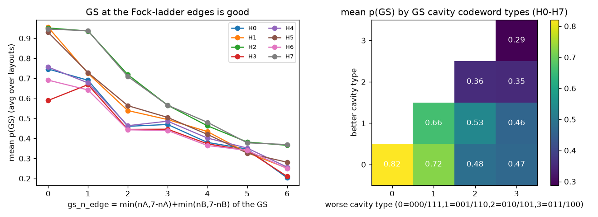
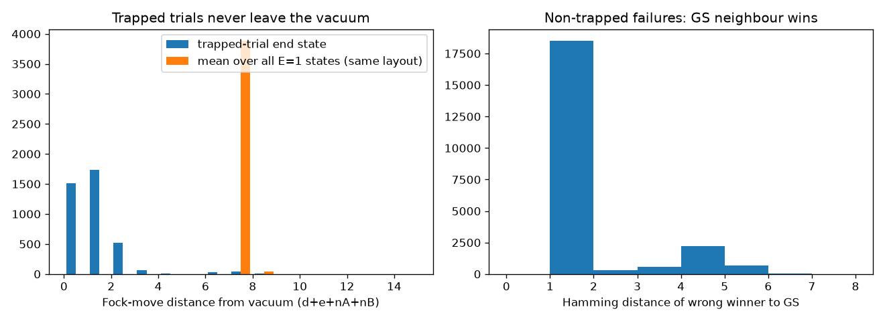

# What makes a layout good or bad — encoding screen, H0–H7

Analysis of the finished part of the full brute-force encoding screen (20,160 layout classes × 3 inits,
tuned growth + SPSA-Adam, jp ECD, n=8 four_sat H0–H7). Pure classical post-processing of the screen
JSONLs; no new quantum runs. Code: `noiseless/analyze_layout_patterns.py`; outputs in
`noiseless/results/layout_patterns/` (`results.json`, `univariate.csv`, `avoid_rules.csv`,
`loho_eval.csv`, `layout_features_H0_H7.parquet`, figures, `preregistered_H8_H19.json`).

Notation: physical slots d, e, A2 A1 A0, B2 B1 B0; n_A = 4·A2 + 2·A1 + A0 (same for B). "GS location" =
the physical state (d, e, n_A, n_B) the 4-SAT solution lands on under a layout. Cavity **codeword type**
of the GS: type 0 = 000/111 (n = 0 or 7), type 1 = 001/110 (n = 1, 6), type 2 = 010/101 (n = 2, 5),
type 3 = 011/100 (n = 3, 4); equivalently type = min(n, 7−n). `gs_n_edge` = type_A + type_B.
Good = top 10 % of layouts by 3-init mean p(GS) per H, bad = bottom 10 %.

## 1. Headline

**Where the solution lands in the Fock grid explains essentially all of the reproducible layout
effect. Clause structure, beyond fixing the GS bitstring, adds nothing measurable.**

- Grouping the 20,160 layouts only by GS location (28–56 distinct locations per H) and averaging inits 1–2
  predicts init 3 *better* than each layout's own init 1–2 mean (Spearman 0.57–0.90 vs 0.54–0.89; better
  on 7/8 H). So two layouts with the same GS location are, within noise, the same layout.
- The dominant variable is how close the GS sits to the **ends of each cavity's Fock ladder** (n = 0 or 7).
  Spearman(gs_n_edge, mean p) = −0.77 median, range −0.88 … −0.62, same sign on **all 8 H**.
- Clause-graph features (coupling within a cavity, clause degree of transmon variables, clauses spanning
  both cavities, …) have |ρ| ≤ 0.05 median. H3 and H4 share **zero** clauses but have the same GS
  (11101110) — that alone gives their 0.77 per-class correlation.
- Caveat for using this in practice: every useful rule needs the GS bitstring, i.e. the answer.
  See §7.

Mean p(GS) by the pair of GS cavity codeword types (pooled over H0–H7; frac = share of layouts):

| better / worse cavity type | frac | mean p(GS) | in top 10 % | in bottom 10 % |
|---|---|---|---|---|
| 0 / 0 (both 000/111) | 3.6 % | **0.82** | 78 % | 1.0 % |
| 0 / 1 | 16.1 % | 0.72 | 44 % | 0.6 % |
| 1 / 1 | 5.4 % | 0.66 | 2.8 % | 0.1 % |
| 0 / 2, 0 / 3 | 32 % | 0.47–0.48 | ≈0 | 2–6 % |
| 1 / 2, 1 / 3 | 21 % | 0.46–0.53 | 0 | ≈1 % |
| 2 / 2, 2 / 3 | 16 % | 0.35 | 0 | 30–36 % |
| 3 / 3 (both 011/100) | 5.4 % | **0.29** | 0 | 61 % |

The earlier "minority value on transmons, majority in cavities" pattern is a consequence: with 5–6 ones
in the GS, the only way to make both cavities 111 (type 0) is to put zeros on the transmons. As an avoid
rule by itself, it is poor (removes 65 % of bad but also 50 % of good).

## 2. Do's and don'ts (numbers = mean over H0–H7, per-H worst case in brackets)

**DON'T — the avoid rule (recommended):** never let either cavity's GS codeword have bit 2 ≠ bit 1,
i.e. GS Fock level n_A or n_B ∈ {2, 3, 4, 5}.
- removes **98.6 % of bad layouts** [worst H: 90 %] and **0.1 % of good layouts** [worst H: 0.9 %];
- removes 75 % of all layouts; the kept 25 % average p(GS) 0.73 vs 0.51 for all layouts.
- Stricter variant `gs_n_edge ≥ 2`: removes 98.7 % of bad, 1.6 % of good [4.2 %], 80 % of all, kept mean 0.77.
- The identity layout violates this rule on 7/8 H (all except H7).

**DO — the prefer rule:** both cavities type 0 (all-equal GS bits: 000 or 111); next best one type 0 + one type 1.
Equivalently minimise `gs_n_edge`. If a cavity must be mixed, put the odd bit on the LSB (A0/B0).

Rules that do **not** work as filters: "both transmons carry the GS majority value" (removes 65 % of bad
but 50 % of good), "GS photon number n_A+n_B ≤ 7" (51 % of bad, 35 % of good, 100 % of good on one H).

Avoid-rule table (`avoid_rules.csv`):

| rule (layout removed if …) | bad removed | good removed | all removed | kept mean p |
|---|---|---|---|---|
| a cavity has GS bit2 ≠ bit1 (n ∈ 2..5) | 98.6 % [min 90.4] | 0.1 % [max 0.9] | 75 % | 0.734 |
| gs_n_edge ≥ 2 | 98.7 % [min 90.8] | 1.6 % [max 4.2] | 80 % | 0.767 |
| both cavities have GS bit2 ≠ bit1 | 83.6 % [min 54.7] | 0 % | 21 % | 0.565 |
| both transmons carry GS majority value | 65.3 % | 49.6 % | 45 % | 0.528 |
| GS photon sum n_A+n_B ≤ 7 | 51.5 % | 34.9 % [max 100] | 30 % | 0.474 |

## 3. Held-out test: leave-one-Hamiltonian-out (fit on 7 H, score the 8th)

Averages over the 8 held-out H. "top-5" = mean p(GS) of the 5 highest-scoring layouts (ties broken by class index),
"top 1 %" = mean over the 202 highest-scoring layouts.

| prefer rule | held-out Spearman | top-1 p(GS) | top-5 p(GS) | top 1 % p(GS) |
|---|---|---|---|---|
| single feature (picked on train: **gs_n_edge** in 8/8 folds) | 0.77 | 0.80 | 0.81 | 0.81 |
| tier rule: gs_n_edge, ties by small ridge | 0.79 | 0.78 | 0.78 | 0.80 |
| ridge on 21 physical/clause features | 0.79 | 0.84 | **0.85** | 0.86 |
| gradient boosting (upper-bound reference only) | **0.88** | 0.87 | 0.87 | 0.86 |
| *baselines:* identity (class 0) | — | 0.585 | | |
| random layout (mean over all layouts) | — | 0.513 | | |
| per-H best layout (in-sample, noisy max) | — | 0.923 | | |

Noise ceiling: the maximum Spearman any predictor can reach against the 3-init mean is ≈ √(reliability) =
0.88–0.97 (median ≈ 0.92). Gradient boosting's 0.88 held-out is close to that ceiling. So the layout effect is
both real and almost fully predictable **given the GS**. The tier rule alone captures most of it
(0.79 vs 0.88). The weak cases are H3 and H6, the two Hamiltonians with the most trapping (§4). There, the
rule's single top pick can land mid-table (top-5 0.58 / 0.43), while top-1 % still averages 0.60 / 0.58.

## 4. Noise ceiling (step 1)

| H | rank corr. between two single inits | reliability of 3-init mean | max explainable ρ | trapped trials | failed trials |
|---|---|---|---|---|---|
| 0 | 0.67 | 0.86 | 0.93 | 0.9 % | 6.7 % |
| 1 | 0.64 | 0.84 | 0.92 | 0.0 % | 4.4 % |
| 2 | 0.84 | 0.94 | 0.97 | 0.0 % | 1.2 % |
| 3 | 0.53 | 0.77 | 0.88 | 2.0 % | 8.7 % |
| 4 | 0.65 | 0.85 | 0.92 | 0.1 % | 5.6 % |
| 5 | 0.70 | 0.87 | 0.93 | 0.1 % | 5.1 % |
| 6 | 0.55 | 0.79 | 0.89 | 3.3 % | 10.2 % |
| 7 | 0.83 | 0.94 | 0.97 | 0.0 % | 1.5 % |

Reliability uses Spearman–Brown on the mean pairwise single-init rank correlation. Trapped = p(GS) < 0.01.
Failed = GS not the most-likely bitstring.

## 5. Failure anatomy (step 2): two failure modes, neither is a "decoy local minimum"

The landscape is a golf course. In every H, ~85 % of the 256 states have energy exactly 1 (one violated clause),
one state has E = 0 and the rest have E = 2–4. No failure ends on a strict local minimum under Fock moves
(n_A±1, n_B±1, transmon flip); all failures end on the E = 1 plateau.

26,265 failed trials out of 483,840:
- **Trapped at the vacuum (3,925 trials, 15 % of failures; almost all on H0, H3, H6):** the winning state is
  within 1 Fock move of the vacuum in **83 %** of cases (38 % exactly the vacuum / logical 00000000). Mean
  distance from vacuum 0.9 moves, vs 7.6 for a typical E = 1 state of the same layout. The optimizer never leaves the
  starting state. The GS is far away: 12.7 moves from the vacuum on average, Hamming distance 5.9.
  Trap rate is only weakly layout-dependent (|ρ| ≤ 0.15 with every feature). It is slightly higher when
  the GS is far from the vacuum, so it is mostly an instance property (H0, H3, H6) rather than a layout one.
- **GS neighbour wins (22,340 trials, 85 %):** the optimizer reaches the right region, but a **Hamming-1
  neighbour** of the GS (83 % of cases) ends up more likely than the GS. It sits on average 3.2 Fock moves from the GS. This is what
  the good layouts reduce: the edge rule correlates with non-trapped p(GS) at ρ = −0.77, about the same as
  with mean p(GS).
- A plausible mechanism, not yet tested: a GS at n = 0 or 7 has only one Fock neighbour per cavity, and the
  E = 1 bulk sits farthest from it (`e1_mean_dist_to_gs`, ρ = +0.70). The ECD state can then concentrate
  on the GS without leaking amplitude into adjacent plateau states.

## 6. Odd cases (step 6)

- **H3 vs H4:** they share **0 of 19 clauses**, and their 256 logical energies correlate at only 0.21. But they
  have the same GS 11101110, so every layout puts their GS in the same place. Given §1, that alone explains
  their per-class correlation of 0.77. They are not near-duplicate instances.
- **Identity on H7 (rank 6 of 20,160):** H7's GS 11000001 under the identity layout is d=1, e=1, A=000
  (n_A=0, type 0) and B=001 (n_B=1, type 1). That is the second-best tier (gs_n_edge = 1), with both
  transmons on the minority value. On H0–H6, the identity puts at least one cavity in type 2/3
  (gs_n_edge 3–4), which explains its middling ranks.

## 7. Caveat: these rules need the solution

Every predictive feature depends on the GS bitstring, which is the answer the circuit is meant to find.
The clause-only features that need no GS knowledge are useless (|ρ| ≤ 0.05). So "pick the layout from the
clause structure" isn't supported. A practical a-priori layout chooser would need a GS estimate. The implemented protocol
(`--relayout` on `run_u_sweep`; `relayout_trial` in `spsa_gibbs.py`) is the iterate-on-the-
trial option: grow L=1→4 on the baseline layout, Hamming-1 polish the most-likely bitstring
(98.4 % recovery of the true GS on H0–H7), re-encode that candidate to both-cavity Fock 0,
and retrain at L=4. See `noiseless/README.md` (Adaptive relayout after L=4).

What the screen does show is that, if the GS were known, placing it at the Fock corners would raise p(GS) from about
0.5 (random layout) to about 0.8 (tier 0/0). How much a single-trial iterate recovers of that
lift is what `--relayout` measures; it is not assumed.

## 8. Pre-registration (step 5)

`layout_patterns/preregistered_H8_H19.json` was committed **before** the screen resumed. It contains:
- the frozen avoid rule;
- the frozen ridge prefer-rule coefficients, trained on H0–H7;
- for each of H8–H19: the avoid fraction, whether the identity layout is avoided, the ridge top-5 (before and
  after the avoid filter), and a gradient-boosting reference top-5.

These come only from the H8–H19 Hamiltonian files. H8 was 83 % screened on disk when the file was frozen, but
its JSONL was not read.
Per-H avoid fractions are 71–80 %, and the identity layout is flagged "avoid" on 10 of 12.
