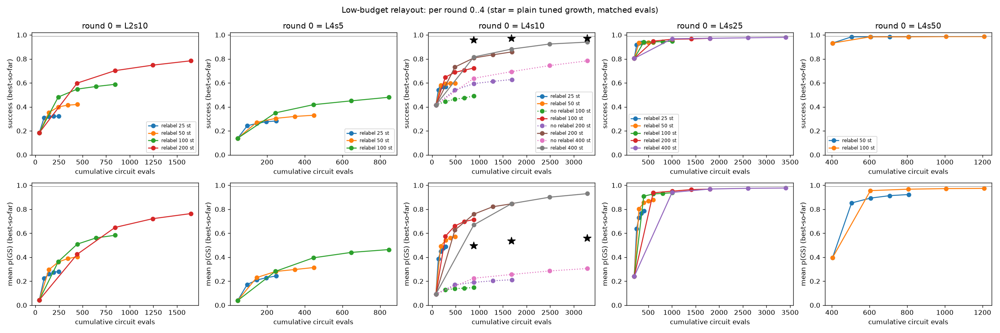
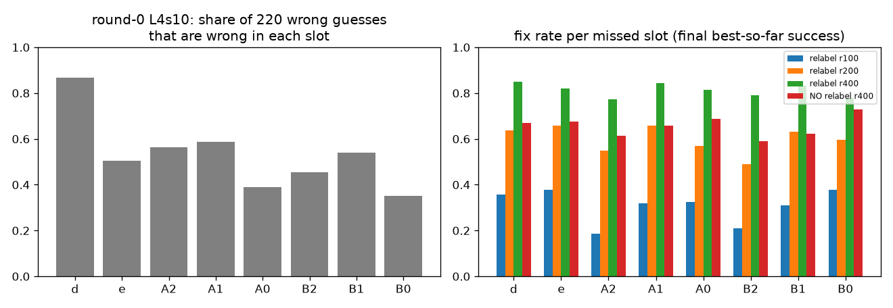

# Low-budget multi-round relayout (2026-10-09)

**Question.** Is there a cheap setting where round 0 is weak (success ≈ 0.5), every relabel round
improves success or mean p(GS) (or both), and only the final round reaches ≈ 0.99 on **both**?

**Answer: no setting in this sweep meets the criterion.** With a weak round 0 (L1→4 at 10 steps/layer,
success 0.416, polished guess right 0.560), four relabel rounds of 400 steps reach **0.940 / 0.930**
at 3288 evals. The best final numbers overall were from a round 0 that isn't weak: L4s50 r100 gets
**0.986 / 0.974** at 1208 evals, but round 0 is already at 0.932 success. Plain tuned growth at the
same budget beats the relabel loop on success at every weak-start budget. Relabel wins clearly on
mean p(GS).

## Setup

- jp gate, identity starting layout, 20 `four_sat` n=8 Hamiltonians (seed 20260917), 25 trials per H
  (500 per setting). Seeds are paired across all settings and controls (`--seed-layers 4`), so every
  setting with the same round 0 shares the identical round 0.
- **Round 0:** tuned growth (SPSA-Adam, warm start, kick 0.05, Gibbs adaptive η). Lr 0.5/0.2/0.05/0.02
  for L1→4 and 0.5/0.2 for L1→2. Levels: L2s10 = L1→2 at 10 steps/layer; L4s5, L4s10, L4s25, L4s50 =
  L1→4 at 5/10/25/50 steps/layer.
- **Each relabel round** (4 rounds, always run, no fixed-point stop):
  1. Take the most likely bitstring of the **best-so-far** round, picked by the lowest Gibbs cost at a
     common η over the rounds so far. This uses no GS knowledge.
  2. Radius-1 polish (9 classical lookups per round, not counted as circuit evals).
  3. XOR-relabel each cavity so the guess sits at Fock (0,0). Transmons are not relabelled.
  4. Train at L=4 from a small-β start (|β|~U(0,0.1)), Adam lr 0.05, r steps (2r+1 evals).
- **Reported after round k:** best-so-far over rounds 0..k by cost. Success = argmax is the GS.
  Mean p(GS) is over 500 trials. Evals are the mean cumulative circuit evaluations.
- **Controls** (round 0 = L4s10):
  1. NO relabel: the same rounds, but each one restarts from small β in the original layout.
  2. Plain tuned growth L1→4 with steps/stage S matched to the total evals: S = 110, 210, 410 for
     r = 100, 200, 400.
- Code: `--relayout-layers`, `--relayout-guess best`, `--no-relayout-fixed-stop`,
  `--relayout-target none` and `--seed-layers` in `run_u_sweep.py`. Scripts are
  `run_relayout_lowbudget.sh` and `run_relayout_lowbudget_controls.sh`. Analysis is
  `analyze_relayout_lowbudget.py`, written to `relayout_lowbudget_summary.json`.

## Per-round table: success / mean p(GS) / cumulative evals (best-so-far, absolute values)

| setting | round 0 | round 1 | round 2 | round 3 | round 4 |
|---|---|---|---|---|---|
| relabel L2s10 r25 | 0.184 / 0.043 / 42 | 0.310 / 0.223 / 93 | 0.318 / 0.259 / 144 | 0.322 / 0.275 / 195 | 0.322 / 0.281 / 246 |
| relabel L2s10 r50 | 0.184 / 0.043 / 42 | 0.352 / 0.295 / 143 | 0.400 / 0.361 / 244 | 0.414 / 0.389 / 345 | 0.420 / 0.404 / 446 |
| relabel L2s10 r100 | 0.184 / 0.043 / 42 | 0.482 / 0.363 / 243 | 0.548 / 0.509 / 444 | 0.570 / 0.561 / 645 | 0.588 / 0.583 / 846 |
| relabel L2s10 r200 | 0.184 / 0.043 / 42 | 0.598 / 0.424 / 443 | 0.702 / 0.648 / 844 | 0.748 / 0.722 / 1245 | 0.784 / 0.764 / 1646 |
| relabel L4s5 r25 | 0.138 / 0.038 / 44 | 0.242 / 0.173 / 95 | 0.262 / 0.210 / 146 | 0.276 / 0.229 / 197 | 0.282 / 0.243 / 248 |
| relabel L4s5 r50 | 0.138 / 0.038 / 44 | 0.270 / 0.230 / 145 | 0.304 / 0.281 / 246 | 0.320 / 0.297 / 347 | 0.330 / 0.314 / 448 |
| relabel L4s5 r100 | 0.138 / 0.038 / 44 | 0.350 / 0.282 / 245 | 0.418 / 0.395 / 446 | 0.450 / 0.440 / 647 | 0.480 / 0.464 / 848 |
| relabel L4s10 r25 | 0.416 / 0.093 / 84 | 0.540 / 0.386 / 135 | 0.566 / 0.450 / 186 | 0.566 / 0.475 / 237 | 0.568 / 0.490 / 288 |
| relabel L4s10 r50 | 0.416 / 0.093 / 84 | 0.580 / 0.493 / 185 | 0.592 / 0.540 / 286 | 0.596 / 0.560 / 387 | 0.598 / 0.570 / 488 |
| relabel L4s10 r100 | 0.416 / 0.093 / 84 | 0.648 / 0.575 / 285 | 0.688 / 0.662 / 486 | 0.706 / 0.697 / 687 | 0.724 / 0.715 / 888 |
| relabel L4s10 r200 | 0.416 / 0.093 / 84 | 0.732 / 0.626 / 485 | 0.808 / 0.759 / 886 | 0.834 / 0.821 / 1287 | 0.858 / 0.846 / 1688 |
| relabel L4s10 r400 | 0.416 / 0.093 / 84 | 0.816 / 0.669 / 885 | 0.882 / 0.847 / 1686 | 0.924 / 0.900 / 2487 | 0.940 / 0.930 / 3288 |
| relabel L4s25 r25 | 0.804 / 0.239 / 204 | 0.916 / 0.638 / 255 | 0.932 / 0.731 / 306 | 0.934 / 0.765 / 357 | 0.936 / 0.788 / 408 |
| relabel L4s25 r50 | 0.804 / 0.239 / 204 | 0.934 / 0.804 / 305 | 0.936 / 0.855 / 406 | 0.936 / 0.870 / 507 | 0.936 / 0.880 / 608 |
| relabel L4s25 r100 | 0.804 / 0.239 / 204 | 0.940 / 0.909 / 405 | 0.942 / 0.927 / 606 | 0.944 / 0.932 / 807 | 0.948 / 0.938 / 1008 |
| relabel L4s25 r200 | 0.804 / 0.239 / 204 | 0.948 / 0.937 / 605 | 0.964 / 0.951 / 1006 | 0.966 / 0.964 / 1407 | 0.972 / 0.968 / 1808 |
| relabel L4s25 r400 | 0.804 / 0.239 / 204 | 0.968 / 0.940 / 1005 | 0.972 / 0.969 / 1806 | 0.976 / 0.975 / 2607 | 0.980 / 0.977 / 3408 |
| relabel L4s50 r50 | 0.932 / 0.396 / 404 | 0.984 / 0.853 / 505 | 0.984 / 0.893 / 606 | 0.984 / 0.913 / 707 | 0.984 / 0.923 / 808 |
| relabel L4s50 r100 | 0.932 / 0.396 / 404 | 0.984 / 0.955 / 605 | 0.984 / 0.967 / 806 | 0.986 / 0.972 / 1007 | 0.986 / 0.974 / 1208 |
| NO relabel L4s10 r100 | 0.416 / 0.093 / 84 | 0.444 / 0.128 / 285 | 0.464 / 0.137 / 486 | 0.474 / 0.143 / 687 | 0.492 / 0.147 / 888 |
| NO relabel L4s10 r200 | 0.416 / 0.093 / 84 | 0.540 / 0.170 / 485 | 0.594 / 0.190 / 886 | 0.612 / 0.203 / 1287 | 0.628 / 0.212 / 1688 |
| NO relabel L4s10 r400 | 0.416 / 0.093 / 84 | 0.638 / 0.225 / 885 | 0.694 / 0.256 / 1686 | 0.744 / 0.285 / 2487 | 0.784 / 0.306 / 3288 |

| setting | guess hit after r0 | r1 | r2 | r3 | r4 |
|---|---|---|---|---|---|
| relabel L2s10 r25 | 0.314 | 0.318 | 0.322 | 0.322 | 0.324 |
| relabel L2s10 r50 | 0.314 | 0.382 | 0.406 | 0.418 | 0.428 |
| relabel L2s10 r100 | 0.314 | 0.500 | 0.556 | 0.576 | 0.594 |
| relabel L2s10 r200 | 0.314 | 0.624 | 0.706 | 0.756 | 0.788 |
| relabel L4s5 r25 | 0.244 | 0.262 | 0.276 | 0.282 | 0.282 |
| relabel L4s5 r50 | 0.244 | 0.294 | 0.308 | 0.326 | 0.330 |
| relabel L4s5 r100 | 0.244 | 0.382 | 0.432 | 0.454 | 0.484 |
| relabel L4s10 r25 | 0.560 | 0.566 | 0.566 | 0.568 | 0.570 |
| relabel L4s10 r50 | 0.560 | 0.584 | 0.594 | 0.596 | 0.598 |
| relabel L4s10 r100 | 0.560 | 0.660 | 0.696 | 0.712 | 0.726 |
| relabel L4s10 r200 | 0.560 | 0.738 | 0.810 | 0.838 | 0.858 |
| relabel L4s10 r400 | 0.560 | 0.828 | 0.892 | 0.926 | 0.940 |
| relabel L4s25 r25 | 0.934 | 0.934 | 0.934 | 0.934 | 0.936 |
| relabel L4s25 r50 | 0.934 | 0.936 | 0.936 | 0.936 | 0.936 |
| relabel L4s25 r100 | 0.934 | 0.940 | 0.942 | 0.946 | 0.948 |
| relabel L4s25 r200 | 0.934 | 0.948 | 0.964 | 0.968 | 0.972 |
| relabel L4s25 r400 | 0.934 | 0.968 | 0.972 | 0.976 | 0.980 |
| relabel L4s50 r50 | 0.984 | 0.984 | 0.984 | 0.984 | 0.984 |
| relabel L4s50 r100 | 0.984 | 0.984 | 0.986 | 0.986 | 0.988 |
| NO relabel L4s10 r100 | 0.560 | 0.582 | 0.594 | 0.610 | 0.624 |
| NO relabel L4s10 r200 | 0.560 | 0.658 | 0.694 | 0.704 | 0.720 |
| NO relabel L4s10 r400 | 0.560 | 0.748 | 0.792 | 0.830 | 0.862 |

Every setting improves success or mean p(GS) in every round, so that part of the criterion always
holds. The final round never reaches 0.99 on both. Settings with weak round 0 (L4s10) get closest at
r400. L2s10 and L4s5 start too weak, with polished guess hit rates of 0.31 and 0.24.

## Controls (round 0 = L4s10, final round 4)

| method | evals | success | mean p(GS) |
|---|---|---|---|
| relabel r100 | 888 | 0.724 | 0.715 |
| NO relabel r100 | 888 | 0.492 | 0.147 |
| plain tuned growth S=110 | 884 | **0.956** | 0.494 |
| relabel r200 | 1688 | 0.858 | **0.846** |
| NO relabel r200 | 1688 | 0.628 | 0.212 |
| plain tuned growth S=210 | 1684 | **0.970** | 0.534 |
| relabel r400 | 3288 | 0.940 | **0.930** |
| NO relabel r400 | 3288 | 0.784 | 0.306 |
| plain tuned growth S=410 | 3284 | **0.972** | 0.559 |

Per-H comparison of the final round, as wins / ties / losses for relabel across 20 H:

| relabel setting | vs NO relabel, success | vs NO relabel, mean p | vs matched growth, success | vs matched growth, mean p |
|---|---|---|---|---|
| L4s10 r100 | 17 / 1 / 2 | 20 / 0 | 0 / 1 / 19 | 17 / 3 |
| L4s10 r200 | 14 / 3 / 3 | 19 / 1 | 0 / 4 / 16 | 19 / 1 |
| L4s10 r400 | 13 / 3 / 4 | 19 / 1 | 3 / 5 / 12 | 19 / 1 |

The relabel itself clearly helps compared with spending the same rounds without it. But splitting
the budget into a cheap round 0 plus restarts loses success against just growing longer.

## Initially wrong guesses: correction rate and which slots are wrong

For L4s10, the polished round-0 guess is wrong in 220 of 500 trials. If it is right, the final
success is 1.000 for every relabel r.

| setting | share of the 220 wrong guesses fixed by round 4 |
|---|---|
| relabel r25 | 0.023 |
| relabel r50 | 0.086 |
| relabel r100 | 0.373 |
| relabel r200 | 0.677 |
| relabel r400 | 0.864 |
| NO relabel r400 | 0.673 |

**Why it is hard.** The polish removes all Hamming-1 misses, so every remaining wrong guess is 2 or
more bits off. By number of wrong bits: 2 bits 1, 3 bits 82, 4 bits 55, 5 bits 39, 6 bits 28,
7 bits 14, 8 bits 1. A small-β round starts at the wrong guess and must move several bits at once.
In wrong-layout rounds at r100 the round finds the GS only 10% of the time. When the incoming guess
is right, that round's success is 1.000 and its mean p(GS) is 0.966.

**Misses by slot** (identity layout, slots d, e, A2, A1, A0, B2, B1, B0). "Missed" counts how many of
the 220 wrong guesses are wrong in that slot (a guess can be wrong in several slots). The fix rate is
the share of those that end in final success.

| slot | missed | fixed r100 | fixed r200 | fixed r400 | fixed NO relabel r400 |
|---|---|---|---|---|---|
| d | 191 | 0.36 | 0.64 | 0.85 | 0.67 |
| e | 111 | 0.38 | 0.66 | 0.82 | 0.68 |
| A2 | 124 | **0.19** | 0.55 | 0.77 | 0.61 |
| A1 | 129 | 0.32 | 0.66 | 0.84 | 0.66 |
| A0 | 86 | 0.33 | 0.57 | 0.81 | 0.69 |
| B2 | 100 | **0.21** | **0.49** | 0.79 | 0.59 |
| B1 | 119 | 0.31 | 0.63 | 0.83 | 0.62 |
| B0 | 77 | 0.38 | 0.60 | 0.78 | 0.73 |

- Transmon d is the most frequently wrong slot: 87% of wrong guesses have d wrong.
- Cavity top bits A2 and B2 are the hardest to fix at low relabel budget: 0.19 and 0.21 at r100,
  against 0.31–0.38 for the other slots. Flipping a top bit means a Fock jump of 4.
- At r400 the gap mostly closes: 0.77–0.79 against 0.78–0.85.

## Takeaways

1. With one relabel round, the round-0 guess sets the ceiling: final success ≈ guess hit rate. Later
   rounds raise it only slowly, because a small-β round anchored at a wrong multi-bit guess rarely
   escapes. That takes 400 steps per round to fix 86% of them.
2. **Cheapest route to 0.99 on both** (from RELAYOUT_SUMMARY.md and this sweep): a decent round 0
   plus one relabel round. D g50 e200 gives 0.990 / 0.985 at 806 evals. Here, L4s50 r100 gives
   0.984 / 0.955 after one round (605 evals) and 0.986 / 0.974 after four rounds (1208 evals). Round 0
   there is not weak (0.932).
3. A weak round 0 is the wrong place to save cost. At matched evals, plain growth keeps success
   0.956–0.972 while the relabel loop sits at 0.72–0.94. Relabel is about +0.3 to +0.4 better on mean
   p(GS), and the relabel step itself beats the no-relabel restart control on both metrics.

## Caveats

- "Weak round 0" is defined here as round-0 success between 0.35 and 0.65. Only L4s10 (0.416)
  qualifies. L2s10 (0.184) and L4s5 (0.138) are too weak, L4s25 (0.804) and L4s50 (0.932) are not weak.
- Polish lookups (9 per round) are not counted in evals. All rounds always ran: with fixed-point stop,
  the evals would be lower for trials whose guess stops changing.
- L2s10 uses the 0.5/0.2 lr schedule (2 stages). Extra rounds are at L=4.
- The 100-step column was not dropped. 200 and 400 steps were added because runs were fast
  (~1 s per trial) and 100 steps was far from 0.99. L4s50 r50/r100 was added as a strong-start
  reference.
