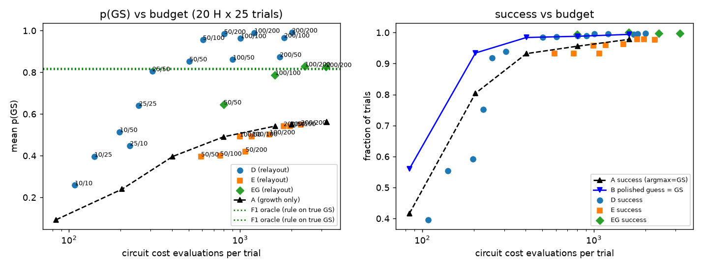

# How to find a good layout (n=8): relayout methods A–F — FINAL, 2026-10-09 03:52 CST

**Status: FINAL.** All planned runs complete: main A–F, D/E resource sweep (including small-g), EG budget
variants, equal-budget A/F1 controls, and jp_local product-gate combinations. Code: `noiseless/run_u_sweep.py`,
`noiseless/spsa_gibbs.py` (`relayout_trial`), `noiseless/encoding.py` (`rule_layout_for_bitstring`,
`polish_bitstring`), `noiseless/layouts.py`. Analysis: `noiseless/analyze_relayout.py` →
`relayout_analysis_summary.json`, `relayout_figs/relayout_budget.png`. Per-trial dumps are kept on the box under
`noiseless/results/relayout_runs/` (gitignored).

## Setup
- **Problem.** The 20 `four_sat` instances (n=8), each with a unique GS. Full form, with x_i ∈ {0,1}, Z_i|x_i⟩ = (1−2x_i)|x_i⟩:
  H = Σ_C Π_{i∈C⁺} (I+Z_i)/2 · Π_{j∈C⁻} (I−Z_j)/2,
  summed over the 14–23 four-literal clauses C (C⁺/C⁻ are its positive/negated literals). H counts unsatisfied
  clauses, so E_GS = 0. Expanded, it is m/16·I plus Z-strings of order 1–4 (m = number of clauses).
  No reduction is applied.
- **Hardware map.** Logical bit i goes to slot perm[i] ∈ {d, e, A2, A1, A0, B2, B1, B0}. Under the binary cavity code,
  Z on cavity bit k is Σ_n (−1)^{⌊n/2^k⌋ mod 2} |n⟩⟨n| (the Fock level n is the 3-bit codeword).
  "XOR relabel" (method C/D) instead maps codeword c → Fock c ⊕ c₀ per cavity.
- **Circuit / optimizer (every method).** ECD local ansatz plus a fixed bus gate (jp by default; jp_local in the
  product-gate section), tuned growth L=1→4 (warm start, kick σ=0.05), and SPSA-Adam with lr 0.5/0.2/0.05/0.02
  at 200 steps/stage, i.e. 1604 evals at the default budget. The cost is the infinite-shot Gibbs cost
  C = −log Σ_x p_θ(x) e^{−η(E(x)−E_min)} + ηE_min with adaptive η.
  Each method runs 25 trials per Hamiltonian, seed 20260917, with seeds shared across methods, so round 0 of every relayout run
  is bit-for-bit the same as A (checked: 500/500).
- **Success** means the argmax bitstring equals the GS. Evals count circuit cost evaluations; classical
  polish lookups (9 energies for radius 1) are not counted.

| method | what it does |
|---|---|
| A | identity layout, tuned growth (1604 evals) |
| B | A's most-likely string + radius-1 classical polish (lowest-energy string within Hamming 1; 9 energy lookups, **0 extra circuit evals**) |
| C | `--relayout` as committed in 70f1f73: XOR the candidate to Fock (0,0), fresh random init (\|β\|~U(0,3)), Adam lr 0.5, 200 steps, ≤2 extra rounds, return the **last** round |
| D | relayout, fixed: lr 0.05, small init (\|β\|~U(0,0.1)), return the **best** round (lowest Gibbs cost at a common η, no GS knowledge), xor_vacuum |
| E | as D, but target = **rule**: permutation-only binary layout from the tier rule (each cavity's codeword 000/111) applied to the polished guess |
| EG | as E, but each extra round **re-grows** L=1→4 in the new layout (`--relayout-init grow`) |
| F1 | oracle: tier-rule layout from the **true** GS, a single tuned run |
| F2 | oracle: per-H screen-best class (H0–H9 only), a single tuned run |

## Main results (20 H × 25 trials; F2 is 10 H × 25)

| method | success | mean p(GS) | median p(GS) | worst-H success | mean evals |
|---|---|---|---|---|---|
| A identity | 0.978 | 0.542 | 0.518 | 0.84 | 1604 |
| B A + polish | **0.994** | (0.542) | – | 0.92 | 1604 (+9 lookups) |
| C as committed | 0.650 | 0.159 | 0.093 | 0.56 | 2153 |
| D fixed, xor_vacuum | **0.998** | **0.991** | 0.995 | 0.96 | 2006 |
| E fixed, target rule | 0.976 | 0.549 | 0.519 | 0.84 | 2264 |
| EG rule + regrow (g200 e200) | **0.998** | 0.826 | 0.804 | 0.96 | 3176 |
| F1 oracle rule(true GS) | 0.988 | 0.816 | 0.803 | 0.92 | 1604 |
| F2 oracle screen-best (H0–H9) | 1.000 | 0.863 | 0.878 | 1.00 | 1604 |
| A on H0–H9 (for F2) | 0.988 | 0.577 | 0.526 | 0.92 | 1604 |
| F1 on H0–H9 (for F2) | 0.992 | 0.820 | 0.806 | 0.96 | 1604 |

**Paired against A** (same seeds; Wilcoxon on Δp; exact McNemar on success flips gained/lost):

| method | mean Δp(GS) | Δp win/tie/loss | Wilcoxon p | success gained/lost | McNemar p |
|---|---|---|---|---|---|
| B | 0 | – | – | 8 / 0 | 0.008 |
| C | −0.384 | 38/1/461 | 1e−75 | 8 / 172 | 3e−41 |
| D | +0.449 | 495/5/0 | 8e−83 | 10 / 0 | 0.002 |
| E | +0.007 | 19/481/0 | 1e−4 | 0 / 1 | 1.0 |
| EG | +0.283 | 398/102/0 | 6e−67 | 10 / 0 | 0.002 |
| F1 | +0.274 | 408/25/67 | 3e−63 | 10 / 5 | 0.30 |
| F2 (H0–H9) | +0.286 | 230/0/20 | 1e−39 | 3 / 0 | 0.25 |

F2 excluding trials 1–3 (the screen used those seeds, so they carry selection bias) gives 1.000 / 0.861, essentially unchanged.

## Resource sweep (D, E, EG): round-0 steps/stage g × extra-round steps e

**Polished-guess hit rate vs round-0 budget**:

| g (steps/stage) | round-0 evals | A success (raw argmax = GS) | A mean p(GS) | B polished guess = GS |
|---|---|---|---|---|
| 10 | 84 | 0.416 | 0.093 | 0.560 |
| 25 | 204 | 0.804 | 0.239 | **0.934** |
| 50 | 404 | 0.932 | 0.396 | **0.984** |
| 100 | 804 | 0.956 | 0.491 | 0.988 |
| 200 | 1604 | 0.978 | 0.542 | 0.994 |

| config | total evals | success | mean p(GS) | Δp vs A (Wilcoxon p) | success gained/lost vs A |
|---|---|---|---|---|---|
| D g10 e10 | 108 | 0.396 | 0.258 | −0.28 (5e−57) | 3/294 |
| D g10 e25 | 140 | 0.554 | 0.395 | −0.15 (1e−17) | 3/215 |
| D g10 e50 | 198 | 0.592 | 0.514 | −0.03 (0.14) | 5/198 |
| D g25 e10 | 227 | 0.752 | 0.449 | −0.09 (2e−15) | 6/119 |
| D g25 e25 | 256 | 0.918 | 0.640 | +0.10 (5e−14) | 9/39 |
| D g25 e50 | 307 | 0.938 | 0.806 | +0.26 (6e−55) | 9/29 |
| D g50 e50 | **505** | 0.984 | 0.853 | +0.31 (3e−72) | 11/8 |
| D g50 e100 | 606 | 0.986 | 0.956 | +0.41 (5e−79) | 11/7 |
| D g50 e200 | 806 | 0.990 | 0.985 | +0.44 (5e−82) | 11/5 |
| D g100 e50 | 906 | 0.990 | 0.861 | +0.32 | 11/5 |
| D g100 e100 | 1007 | 0.996 | 0.964 | +0.42 | 11/2 (p=0.02) |
| D g100 e200 | 1209 | 0.996 | 0.990 | +0.45 | 11/2 |
| D g200 e50 | 1705 | 0.994 | 0.874 | +0.33 | 8/0 |
| D g200 e100 | 1805 | 0.996 | 0.967 | +0.43 | 9/0 |
| D g200 e200 | 2006 | 0.998 | 0.991 | +0.45 | 10/0 |
| E g50 e50…e200 | 591–1075 | 0.932 | 0.40–0.42 | −0.12 to −0.15 | 10/33 |
| E g100 e50…e200 | 994–1485 | 0.96 | 0.49–0.50 | −0.04 to −0.05 | 9/18 |
| E g200 e50…e200 | 1792–2264 | 0.976–0.978 | 0.542–0.549 | ≈0 | 0/0–1 |
| EG g50 e50 | 802 | 0.994 | 0.646 | +0.10 (5e−18) | 11/3 |
| EG g100 e100 | **1600** | **1.000** | 0.788 | +0.25 (2e−69) | 11/0 |
| EG g100 e200 | 2389 | 0.998 | 0.828 | +0.29 (5e−73) | 11/1 |
| EG g200 e200 | 3176 | 0.998 | 0.826 | +0.28 (6e−67) | 10/0 |

**Equal-budget growth-only controls and oracle F1 at reduced budget:**

| config | evals | success | mean p(GS) | Δp vs A |
|---|---|---|---|---|
| A g250 (≈ D g200 e200 budget) | 2004 | 0.990 | 0.550 | +0.008 (p=0.04) |
| A g400 (≈ EG g200 e200 budget) | 3204 | 0.962 | 0.563 | +0.021 (p=3e−6) |
| F1 g50 | 404 | 0.976 | 0.615 | +0.073 |
| F1 g100 | 804 | 0.988 | 0.773 | +0.231 |

Just spending more steps on the identity layout barely moves mean p(GS) (0.542 → 0.550 → 0.563). The same
budget spent on D or EG buys a completely different regime (0.99 or 0.83).

**Cheapest config that beats A on both success and mean p(GS) (Wilcoxon p < 0.05):** D g50 e50 at **505 evals,
31% of A's budget** (success 0.984 vs 0.978, not significant on McNemar; mean p(GS) 0.853 vs 0.542, p = 3e−72).
D g50 e100 (606 evals) reaches 0.956. To beat A on success *significantly*, the cheapest is D g100 e100
(1007 evals, 0.996, McNemar p=0.02). Small-g D (g∈{10,25}) never reaches A's success: at g25 e50 (307 evals)
success is only 0.938 even though mean p(GS) is already 0.806 — the round-0 guess is still wrong too often
(B hit rate 0.934, round-0 success 0.804).



## Product gate jp_local combinations

Same methods, bus gate U = jp_local instead of jp. Numbers are success / mean p(GS) / mean evals.

| method | jp (from above) | jp_local | Δp (jl − jp), Wilcoxon |
|---|---|---|---|
| A identity | 0.978 / 0.542 / 1604 | **0.998 / 0.640 / 1604** | +0.098 (2e−46); success +11/−1 |
| F1 oracle rule(true GS) | 0.988 / 0.816 / 1604 | 0.984 / **0.890** / 1604 | +0.074 (1e−32) vs F1; +0.250 vs A_jl |
| D g25 e25 | 0.918 / 0.640 / 256 | 0.918 / 0.649 / 256 | +0.009 (0.54) vs D |
| D g50 e50 | 0.984 / 0.853 / 505 | **0.994 / 0.871 / 505** | +0.018 (0.04) vs D |
| D g50 e100 | 0.986 / 0.956 / 606 | 0.996 / 0.967 / 606 | +0.012 (0.21) vs D |
| D g200 e200 | 0.998 / 0.991 / 2006 | **1.000 / 0.993 / 2005** | +0.002 (0.17) vs D |
| EG g200 e200 | 0.998 / 0.826 / 3176 | **1.000 / 0.907 / 3176** | +0.081 (3e−45) vs EG |

D under jp_local is essentially the same story as under jp (vacuum placement after a correct guess;
Δp vs matched D is ~0–0.02). The product gate **does** raise the identity-layout and rule+regrow baselines:
A_jl is already 0.998 / 0.640, and EG_jl reaches 1.000 / 0.907 — matching the entanglement-control finding
that jp_local is the stronger bus gate. Relayout's qualitative ranking (B for cheap success; D for vacuum
p(GS); EG ≈ F1 for honest permutation layouts) is unchanged.

## What this means (plain words)
1. **The committed relayout (C) is broken.** Its extra rounds start from a random init with |β| up to 3 at lr 0.5. The
   optimizer blows |β| up to 5–9 and loses the state: 92% of trials end *below* their own round-0 p(GS),
   and it returns the last round instead of the best.
2. **D gives p(GS) ≈ 0.99, but mostly because of where it puts the answer.** The XOR relabel puts the guessed GS at
   Fock (0,0), the **initial vacuum state**. Once the guess is right, the circuit only has to stay near |d*,e*,0,0⟩,
   which a small-β init does almost trivially. So D's p(GS) mostly measures whether the classical guess was right
   (B's hit rate, 0.560 at g10 → 0.984 at g50 → 0.994 at g200), not a better optimization of the original problem.
   D adds +0.002 to +0.004 success over B, from the extra round fixing a wrong guess. Equal-budget A (g250 at
   2004 evals → p=0.550) confirms the gain is not "more SPSA steps."
3. **For success at minimum cost, B is the winner.** It costs no extra circuit evals: 9 classical energy lookups
   lift success from 0.978 to 0.994 at 1604 evals, from 0.932 to 0.984 at 404 evals, and from 0.804 to 0.934 at
   204 evals. At n=8 a radius-1 polish is a legitimate local search costing n+1 clause evaluations, and it scales
   to large n, unlike the 256-entry table used here. Below ~200 round-0 evals the guess is too often wrong for
   D/B to beat A.
4. **The permutation rule (E) needs a re-grow.** With a small init at Fock 7 the new round can't reach the GS, so E
   "best" just falls back to round 0. With a re-grow (EG), even at g50 e50 (802 evals) it reaches 0.994 / 0.646;
   at g100 e100 (1600 evals, ≈ A's budget) it hits **1.000 / 0.788**, matching the true-GS oracle F1 at g100
   (0.988 / 0.773). The guess is good enough that a guessed rule layout is as good as the oracle rule layout.
5. **The oracles confirm the screen's rule.** Rule-on-true-GS F1 gives +0.27 p(GS) over identity, and the per-H screen
   best F2 gives +0.29 on H0–H9, so the simple rule recovers ≈90% of the brute-force best's gain (0.820 vs 0.863 on H0–H9).
   F1 is weakest when the GS has 6 ones (both cavities forced to Fock 7: 0.68–0.77). It reaches 0.92–0.95 when one cavity can sit at Fock 0.
6. **Switching the bus gate to jp_local does not change the relayout ranking**, but raises every non-vacuum baseline
   (A +0.10, F1 +0.07, EG +0.08). Prefer jp_local for identity / rule layouts; D's vacuum p(GS) is already saturated.

## Bugs / caveats
- C (`--relayout` defaults from 70f1f73): the extra-round lr of 0.5 with a random init is the bug. The defaults are kept for
  reproducibility; use `--relayout-lr 0.05 --relayout-init small --relayout-return best`.
- D's p(GS) is not comparable to A's as a measure of optimizer quality (see point 2). Compare successes, or use B.
- "best" selection uses the Gibbs cost re-evaluated at the largest end-of-round η, which needs no GS knowledge.
- The polish uses a precomputed 256-entry energy table, which is fine at n=8. At large n it would be n+1 clause evaluations.

All planned follow-ups are complete.

## Commands
```bash
R=noiseless/results/relayout_runs
python -m noiseless.run_u_sweep --trials 25 --workers 8 --outdir $R --tag rl_A                    # A
python -m noiseless.run_u_sweep --relayout --trials 25 --workers 8 --outdir $R --tag rl_C         # C
python -m noiseless.run_u_sweep --relayout --relayout-lr 0.05 --relayout-init small --relayout-return best \
  --trials 25 --workers 8 --outdir $R --tag rl_D                                                   # D
#  E: D + --relayout-target rule ; EG: --relayout --relayout-init grow --relayout-return best --relayout-target rule
#  F1: --layout rule_best ; F2: --layout screen_best --max-h 10
#  sweep: add --grow-steps-per-stage g --relayout-steps e
#  jp_local: add --u-names jp_local
python noiseless/analyze_relayout.py
```
